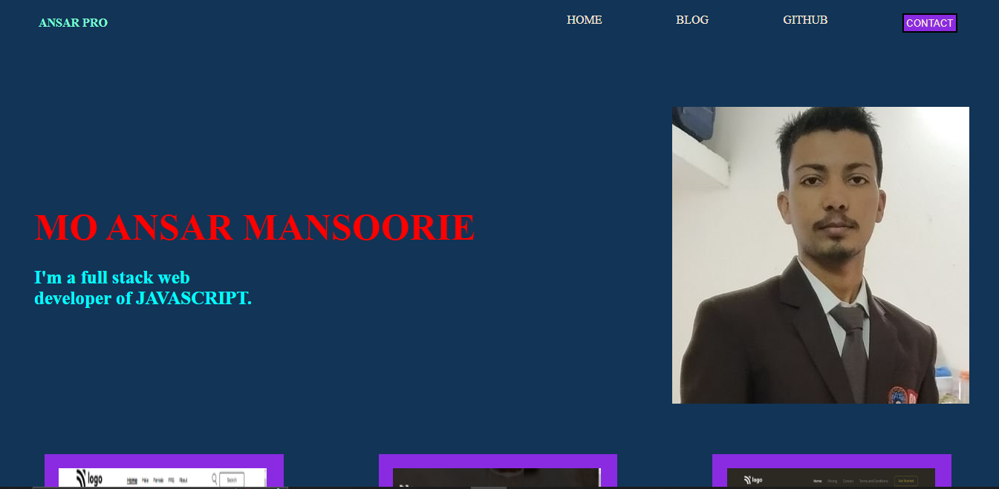

# Project [MY PORTFOLIO]

## This is created by me.(Mo Ansar Mansoorie)

[Link of live PORTFOLIO for view](https://myportfolioansar.netlify.app/)

# What I learned from this project.

- This project is used to storing my work in a simple way.
- It is helpful to convey our work to anyone.
- It is used to present my all work as the begineer to prgressive way.
- Portfolio is helpful to view all my work on my side as well as another side.

# Howmany Time will be consumed to making this project.

- This portfolio have taken 3 hours to complete this project.But as the new update of my side, I am doing work according the need of this presentation.